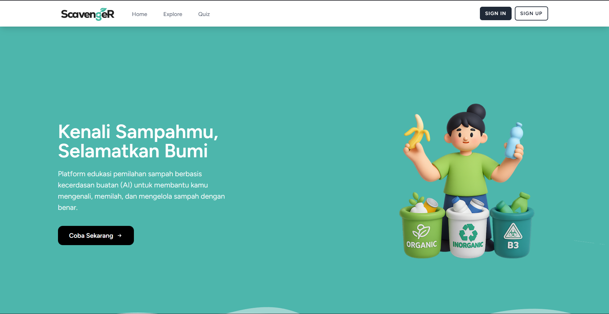

# ♻️ Scavenger (Tugas Akhir P3L - Semester 3)
**From Waste to Wisdom: The AI-Powered Eco Revolution**



## 📖 Tentang Projek

**Scavenger** adalah platform edukasi interaktif berbasis web yang bertujuan untuk merevolusi cara masyarakat memandang dan mengelola sampah. Menggabungkan kekuatan **Artificial Intelligence** dengan gamifikasi, Scavenger mengubah aktivitas memilah sampah yang membosankan menjadi pengalaman yang menyenangkan dan mendidik.

Aplikasi ini dibangun menggunakan **Laravel** dan **Tailwind**, dirancang untuk membantu pengguna mengidentifikasi jenis sampah, memahami dampaknya, dan membangun kebiasaan ramah lingkungan yang berkelanjutan.

---

## 🚀 Fitur Utama

### 👤 User Experience
- **📚 Smart Waste Encyclopedia** Edukasi visual mengenai jenis sampah (Organik, Anorganik, B3, Residu) beserta cara pengelolaannya.
- **🤖 AI-Powered Waste Lens** Fitur cerdas untuk mengidentifikasi dan mengklasifikasikan sampah secara otomatis menggunakan AI.
- **🧠 Gamified Eco-Challenge** Quiz interaktif untuk menguji pemahaman pengguna tentang lingkungan.
- **💬 Learn with AI Companion** Asisten virtual yang siap menjawab pertanyaan seputar lingkungan dan tips daur ulang.

### 🛡️ Admin Dashboard
- **Manajemen Data Sampah:** CRUD (Create, Read, Update, Delete) data jenis sampah dan materi edukasi.
- **Monitoring User:** Memantau aktivitas dan progres pengguna.
- **AI Configuration:** Pengaturan dataset atau parameter klasifikasi AI.

---

## 🛠 Teknologi yang Digunakan

Proyek ini dibangun menggunakan *tech stack* modern untuk memastikan performa dan skalabilitas:

| Kategori | Teknologi |
| :--- | :--- |
| **Framework** | [Laravel](https://laravel.com/) (dengan Laravel Breeze) |
| **Language** | PHP 8.x |
| **Database** | MySQL |
| **Frontend** | [Tailwind CSS](https://tailwindcss.com/) & Blade Templates |
| **Interactivity** | [Alpine.js](https://alpinejs.dev/) |
| **Build Tool** | Vite |
| **Deployment** | Ngrok (untuk tunneling/testing) |

---

## ⚙️ Instalasi & Cara Menjalankan

Ikuti langkah-langkah berikut untuk menjalankan proyek ini di komputer lokal Anda:

### Prasyarat
- PHP >= 8.1
- Composer
- Node.js & NPM
- MySQL

### Langkah-langkah

1.  **Clone Repository**
    ```bash
    git clone [https://github.com/username-anda/scavenger.git](https://github.com/username-anda/scavenger.git)
    cd scavenger
    ```

2.  **Install Dependencies (Backend)**
    ```bash
    composer install
    ```

3.  **Install Dependencies (Frontend)**
    ```bash
    npm install
    ```

4.  **Konfigurasi Environment**
    Duplikat file `.env.example` menjadi `.env`:
    ```bash
    cp .env.example .env
    ```
    Buka file `.env` dan sesuaikan konfigurasi database Anda:
    ```env
    DB_CONNECTION=mysql
    DB_HOST=127.0.0.1
    DB_PORT=3306
    DB_DATABASE=scavenger_db
    DB_USERNAME=root
    DB_PASSWORD=
    ```

5.  **Generate App Key**
    ```bash
    php artisan key:generate
    ```

6.  **Migrasi Database**
    Jalankan migrasi untuk membuat tabel (pastikan database `scavenger_db` sudah dibuat di MySQL):
    ```bash
    php artisan migrate --seed
    ```
    *(Gunakan `--seed` jika Anda sudah menyiapkan data dummy untuk Admin/User)*

7.  **Jalankan Aplikasi**
    Buka dua terminal terpisah:
    
    *Terminal 1 (Server Laravel):*
    ```bash
    php artisan serve
    ```

    *Terminal 2 (Vite Build):*
    ```bash
    npm run dev
    ```

8.  **Akses Aplikasi**
    Buka browser dan kunjungi: `http://127.0.0.1:8000`

---

## 🌐 or Deployment (Ngrok)

Jika ingin membagikan akses lokal ke internet menggunakan Ngrok:

1.  Pastikan `php artisan serve` dan `npm run dev` berjalan.
2.  Jalankan perintah berikut di terminal baru:
    ```bash
    ngrok http 8000
    ```
3.  Salin URL yang diberikan Ngrok (contoh: `https://xxxx-xxxx.ngrok-free.app`) dan bagikan.

---

## 📝 Lisensi

This project is open-sourced software licensed under the [MIT license](https://opensource.org/licenses/MIT).


# THANK YOU.